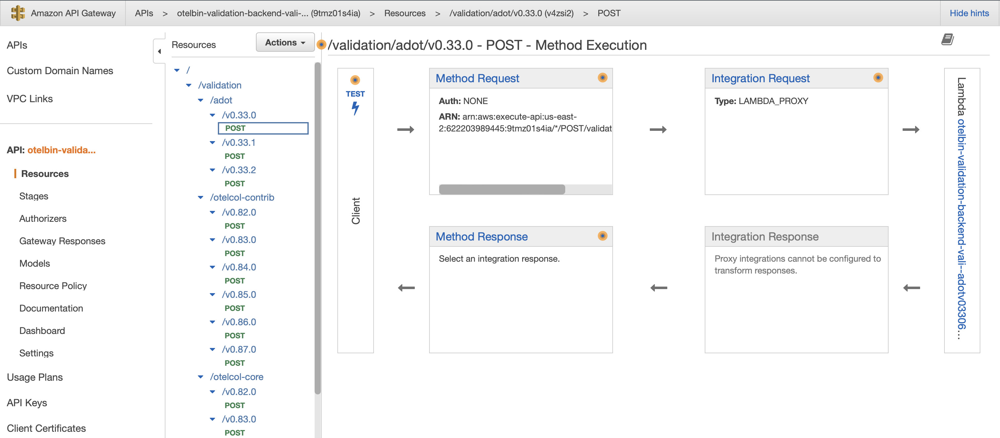

# Validation infrastructure

OTelBin supports validation that is specific to multiple distributions of the OpenTelemetry collector.
The supported distros and versions are listed in the [`./src/assets/supported-distributions.json`](./src/assets/supported-distributions.json) file.
The distributions are assumed to be available as GitHub releases.

## Overview

The validation backend is a [AWS CDK v2 app](./src/main.ts).
The validation against specific distributions is exposes to the internet using an AWS API Gateway, secured by an API Key.
The API Gateway, which exposes routes using the `/validation/${distribution_name}/${version}` pattern.
Each such route is routed to a different AWS Lambda function using a [Docker image](./src/images/otelcol-validator), which is dedicated to validating a particular version of a particular distro.
The AWS Lambda function has a [Node.js handler](./src/images/otelcol-validator/src/index.ts), which is responsible to receive the API Gateway events, extract from the the YAML of the configuration to validate, save that to a file, start the collector with the provided configuration, and return the outcome as API Gateway reponse.

## How to add support for a new distribution

1. Make sure the distribution has
   1. RPM packages...
   1. ... listed as artifacts or mentioned as links in the body of a GitHub release in a `<github_org>/<repo_name>` repository
1. Add the initial metadata about your distro in the [`supported-distributions.json`](./src/assets/supported-distributions.json) file, e.g.:
   ```json
   {
      ...,
      "my-distro": {
         "provider": "My company",
         "description": "Much wow",
         "icon": "my-icon",
         "website": "https://my-company.io",
         "repository": "<github_org>/<repo_name>",
         "releases": []
      }
   }
   ```
   The `icon` field uses an identifier that must be wired in the frontend via the [`ValidationTile.tsx`](../otelbin/src/components/validation-type/ValidationTile.tsx), using an SVG icon with width and height of 24px saved in the [`distro-icons`](../otelbin/src/components/assets/svg/distro-icons/) folder.
1. Fill in data about one release manually to run tests:
   ```json
   {
      ...,
      "my-distro": {
         "provider": "My company",
         "description": "Much wow",
         "website": "https://my-company.io",
         "icon": "my-icon",
         "repository": "<github_org>/<repo_name>",
         "releases": [
            {
               "version": "v0.88.0", # Tag name to be shown in OTelBin, keep it SemVer please
               "artifact": "otelcol_0.88.0_linux_amd64.rpm", # Name of the artifact attached to the release; could also be a full URL to download the package
               "released_at": "2023-10-24T11:24:58.000Z"
            }
      }
   }
   ```
1. If you distribution does not support the [`validate` command](https://github.com/open-telemetry/opentelemetry-collector/blob/2e44da36e2c666db35884dca2c4df543b56a6aba/otelcol/command_validate.go#L14) of the community releases, you will need to write some bespoke logic to detect that the OpenTelemetry collector bootstrapped correctly with the given configuration.
   ADOT is currently such an example, see the [`otelbin-validation-handler`](../otelbin-validation-image/src/index.ts).
1. [Deploy the backend validation](#deployment) in an AWS account, and [run the tests](#testing-the-validation-api).
1. Extend the nightly automation to [discover new releases](../../.github/workflows/discover-new-releases.yaml) to automatically track new releases of your distro.
1. Open a great PR :-)

## Deployment

1. Log in with the [`AWS cli`](https://aws.amazon.com/cli/) to the account you want to deploy.
   Ensure you have a profile that uses the region you want to deploy in, e.g.:
   ```json
   [otelbin-dev]
   aws_access_key_id = <access_key_id>
   aws_secret_access_key = <secret_access_key>
   region = <region>
   output = json
   ```
   The AWS Access Key should be capable to bootstrap the AWS CDK.
   It is not quite clear what is the minimum set of permissions to bootstrap with the AWS CDK, but a role with the `AdministratorAccess` can do that
   1. Get a GitHub classic token, which is needed by the automation to be able to download GitHub release artifacts using the [`gh`](https://cli.github.com) utility.
1. Run:
   ```sh
   GH_TOKEN=<token> npm run deploy --profile otelbin-dev
   ```
   The output of the CDK will give you information you need for trying the API, e.g.:
   ```sh
   otelbin-validation-backend-vali-95773.apikeyid = u8hnc02ug6
   otelbin-validation-backend-vali-95773.apiname = otelbin-validation-backend-vali-95773
   otelbin-validation-backend-vali-95773.apiurl = https://9tmz01s4ia.execute-api.us-east-2.amazonaws.com/prod/
   otelbin-validation-backend-vali-95773.validationapiEndpointE3717CC6 = https://9tmz01s4ia.execute-api.us-east-2.amazonaws.com/prod/
   ``` 
1. Logging in the AWS Console, and going to the CloudFormation console, you should see a `otelbin-validation-dev` stack.
   The `validation-api` API Gateway RestApi is the "entrypoint" of the validation API, which will expose multiple resources like the following:
   

# Testing the Validation API

Using the built-in `Test` capabilities of the API Gateway console is the easiest way to try out the Validation API.

Alternatively, you can retrieve the value of the API Key from the API Gateway console, and issue HTTP requests towards the Validation API, e.g.:

```sh
# Retrieving the supported distribution versions
$ curl https://${API_ID}.execute-api.${AWS_REGION}.amazonaws.com/prod/validation/supported-distributions --header "X-Api-Key: ${API_KEY}"

{
  "otelcol-core": {
    "provider": "OpenTelemetry Community - Core",
    "description": "OpenTelemetry Collector core community builds",
    "website": "https://opentelemetry.io",
    "repository": "open-telemetry/opentelemetry-collector-releases",
    "releases": [
      {
        "version": "v0.87.0",
        "artifact": "otelcol_0.87.0_linux_amd64.rpm",
        "released_at": "2023-10-11T06:06:02.000Z"
      },
      ...
   ]
  },
  ...
}
```

```sh
# Validating a an empty configuration
$ curl https://${API_ID}.execute-api.${AWS_REGION}.amazonaws.com/prod/validation/${DISTRO_NAME}/${VERSION} --header "X-Api-Key: ${API_KEY}" --data "${CONFIGURATION}"
{"message":"The provided configuration is invalid","error":"the provided configuration is empty"}
```

# Debugging

The routing of requests by the API Gateway towards AWS Lambda is unlikely to cause issues.
But one may need to debug what is going on within the AWS Lambda invocations, and the [CloudWatch logs](https://docs.aws.amazon.com/lambda/latest/dg/monitoring-cloudwatchlogs.html) are an excellent starting point.
